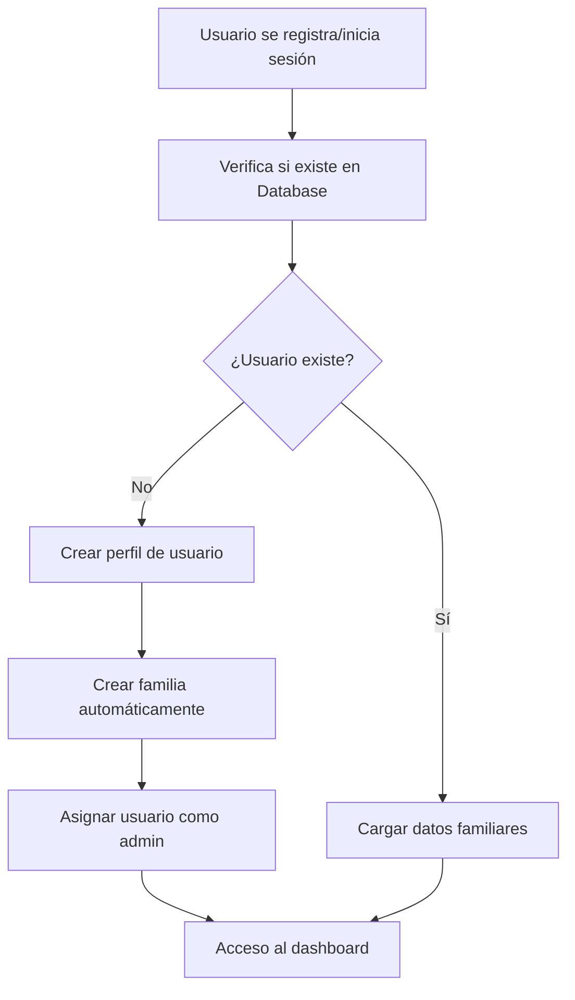

# Solución del Error de Permission Denied en Firebase Database

## Problema Identificado

El error `permission_denied` en la ruta `/familias/58F86EC6-86D9-4D02-A797-9D9A2F5E7998/miembros/fzrLTM6SNLh3WID5MU7fw5slQD02` se debe a que las reglas de Firebase Database no están actualizadas y no permiten la creación de familias por usuarios autenticados.

## Cambios Implementados

### 1. **Método Atómico para Creación de Familia**
- **Archivo**: `FamilOS/Services/FirebaseService.swift`
- **Método**: `crearFamiliaConAdministrador(_ familia: Familia, administrador: MiembroFamilia)`
- **Descripción**: Crea la familia y agrega el primer miembro (administrador) en una sola operación, evitando problemas de atomicidad.

### 2. **Mejora del Flujo de Autenticación**
- **Archivo**: `FamilOS/ViewModels/AuthViewModel.swift`
- **Método modificado**: `crearPerfilUsuario(uid: String)`
- **Descripción**: Ahora crea automáticamente una familia cuando se detecta un usuario sin familia asignada.

### 3. **Mejor Logging y Diagnóstico**
- **Archivos**: `FirebaseService.swift` y `AuthViewModel.swift`
- **Funcionalidad**: `logFirebaseError(_ error: Error, operation: String)`
- **Descripción**: Agrega logging detallado para identificar errores específicos de Firebase Database.

### 4. **Reglas de Seguridad Corregidas**
- **Archivo**: `firebase-database-rules.json`
- **Cambios principales**:
  - Permite creación de familias si no existen previamente
  - Permite escritura a usuarios admin/miembros
  - Corregida sintaxis y lógica de validación

## Instrucciones para Resolver el Error

### **PASO CRÍTICO: Actualizar Reglas en Firebase Console**

1. **Abrir la consola de Firebase**: https://console.firebase.google.com/
2. **Seleccionar el proyecto FamilOS**
3. **Ir a "Realtime Database" → "Reglas"**
4. **Reemplazar las reglas existentes** con el contenido de `firebase-database-rules.json`
5. **Hacer clic en "Publicar"**

### **Para Pruebas Temporales (Menos Seguro)**
Si necesitas probar inmediatamente, puedes usar las reglas temporales del archivo `firebase-rules-temp.json` que son más permisivas.

## Archivos Modificados

### Archivos Principales
- ✅ `FamilOS/Services/FirebaseService.swift` - Método atómico y mejor logging
- ✅ `FamilOS/ViewModels/AuthViewModel.swift` - Creación automática de familia
- ✅ `firebase-database-rules.json` - Reglas corregidas

### Archivos de Ayuda
- 📄 `firebase-rules-temp.json` - Reglas temporales para pruebas
- 📄 `actualizar-reglas-firebase.sh` - Script con instrucciones detalladas
- 📄 `SOLUCION_PERMISSION_DENIED.md` - Este archivo

## Validación de la Solución

### Antes de la Corrección
```
❌ permission_denied al intentar crear familia
❌ Usuario sin familia no puede acceder al dashboard
❌ Flujo de registro incompleto
```

### Después de la Corrección
```
✅ Creación atómica de familia y administrador
✅ Usuario automáticamente asignado como admin
✅ Acceso completo al dashboard tras registro/login
✅ Logging detallado para diagnóstico
```

## Próximos Pasos

1. **Actualizar reglas en Firebase Console** (CRÍTICO)
2. **Probar el flujo de registro y login**
3. **Verificar logging en la consola de Xcode**
4. **Reemplazar reglas temporales con reglas completas**
5. **Validar que el dashboard carga correctamente**

## Estructura del Flujo Corregido



## Contacto

Si el error persiste después de actualizar las reglas de Firebase, revisar:
1. La consola de Xcode para logs detallados
2. La consola de Firebase para errores de reglas
3. La configuración del proyecto Firebase

---

**Nota**: El paso más importante es actualizar las reglas en la consola de Firebase. Sin este paso, el error `permission_denied` continuará ocurriendo.
